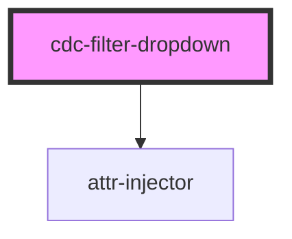

# cdc-filter-dropdown

<!-- Auto Generated Below -->

## Properties

| Property      | Attribute     | Description | Type     | Default |
| ------------- | ------------- | ----------- | -------- | ------- |
| `placeholder` | `placeholder` |             | `string` | `''`    |

## Dependencies

### Depends on

- [attr-injector](../../global/attr-injector)

### Graph

----------------------------------------------

*Built with [StencilJS](https://stenciljs.com/)*
