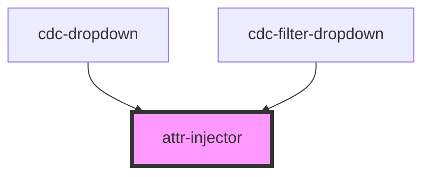

# attr-injector

<!-- Auto Generated Below -->

## Properties

| Property | Attribute | Description | Type  | Default |
| -------- | --------- | ----------- | ----- | ------- |
| `attrs`  | `attrs`   |             | `any` | `{}`    |

## Dependencies

### Used by

 - [cdc-dropdown](../../inputs/cdc-dropdown)
 - [cdc-filter-dropdown](../../filter/cdc-filter-dropdown)

### Graph

----------------------------------------------

*Built with [StencilJS](https://stenciljs.com/)*
