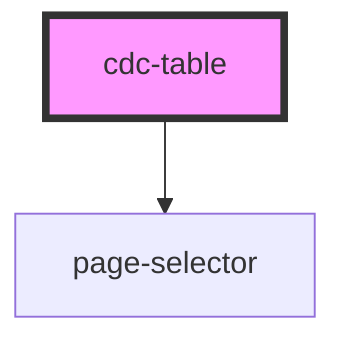

# cdc-table

<!-- Auto Generated Below -->

## Properties

| Property        | Attribute       | Description | Type      | Default     |
| --------------- | --------------- | ----------- | --------- | ----------- |
| `goToPage`      | `go-to-page`    |             | `number`  | `1`         |
| `numberofpages` | `numberofpages` |             | `number`  | `undefined` |
| `pageselector`  | `pageselector`  |             | `boolean` | `true`      |

## Dependencies

### Depends on

- [page-selector](../page-selector)

### Graph

----------------------------------------------

*Built with [StencilJS](https://stenciljs.com/)*
