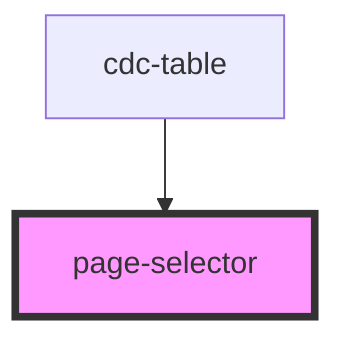

# page-selector

<!-- Auto Generated Below -->

## Properties

| Property        | Attribute       | Description | Type     | Default |
| --------------- | --------------- | ----------- | -------- | ------- |
| `gotopage`      | `gotopage`      |             | `number` | `1`     |
| `numberofpages` | `numberofpages` |             | `number` | `1`     |

## Events

| Event           | Description | Type                  |
| --------------- | ----------- | --------------------- |
| `tablegotopage` |             | `CustomEvent<number>` |

## Dependencies

### Used by

 - [cdc-table](../cdc-table)

### Graph

----------------------------------------------

*Built with [StencilJS](https://stenciljs.com/)*
